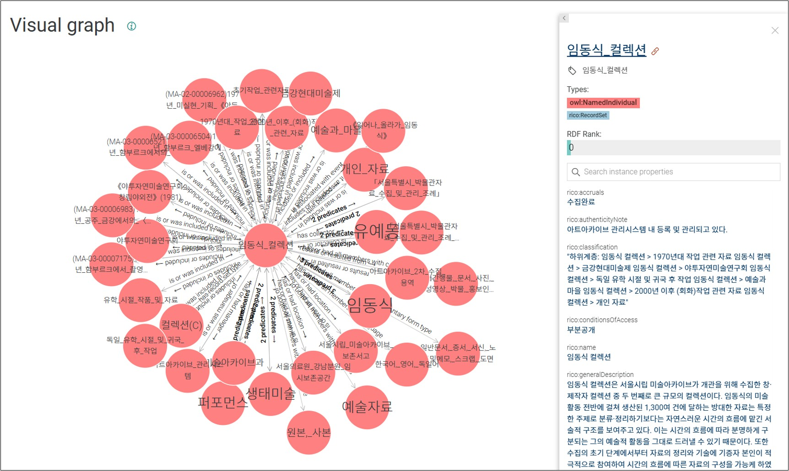
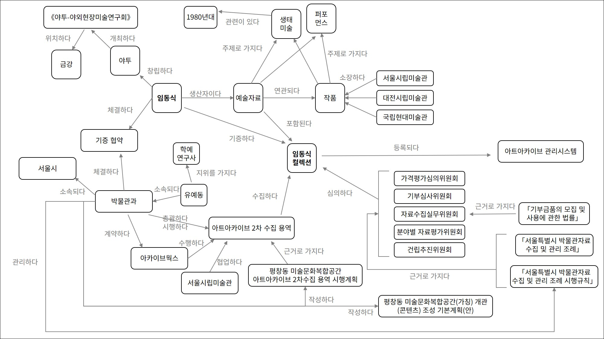
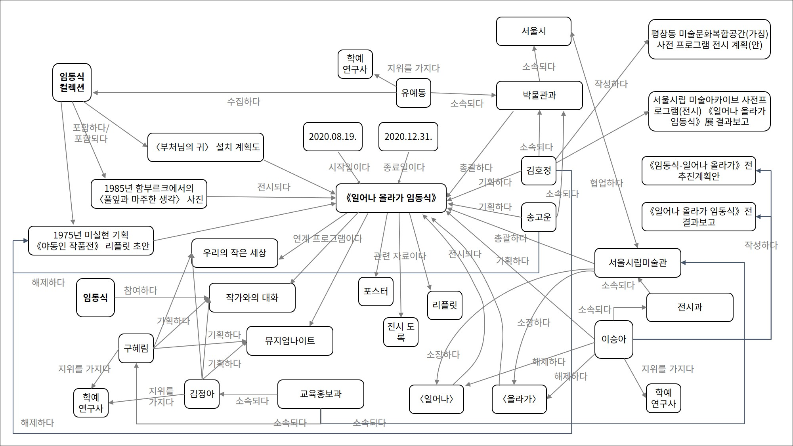
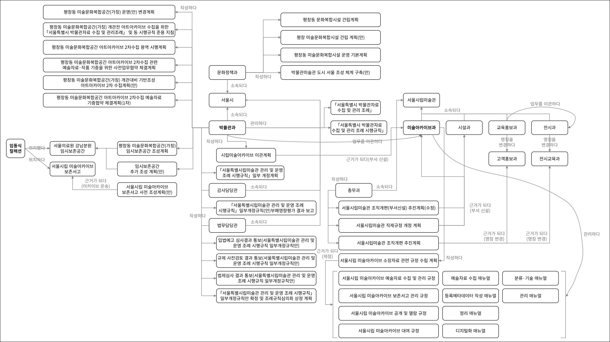
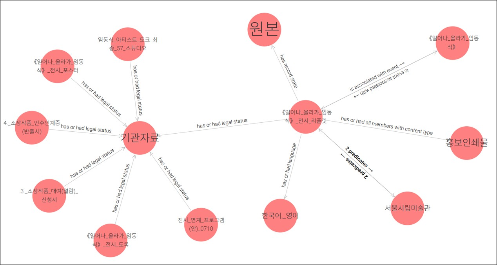
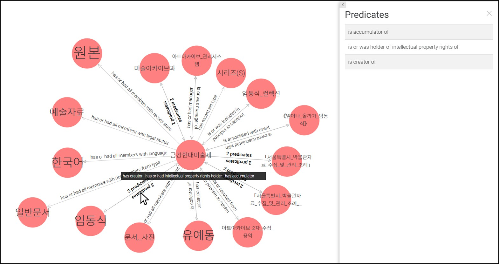

<h2 align="center">컬렉션시각화Beta</h2>

**
🌐<a href="README(EN).md">English Version</a>
**

### **1. 개요**

서울시립 미술아카이브의 컬렉션시각화 Beta는 소장 컬렉션에 RiC을 적용하여 시각화한 온톨로지 그래프입니다. 컬렉션과 관련된 모든 개념을 원형의 노드(주요 연결점)로 표현하고, 이들을 연결하는 선으로 개념 간의 관계를 나타냈습니다. 여기에는 소장자료, 전거 레코드, 시소러스뿐만 아니라 작품, 부서, 규정 등 기존의 컬렉션시각화에서 연결되지 못했던 개념들까지 모두 포함됩니다. 컬렉션시각화 Beta를 통해 소장자료가 생산되어 컬렉션으로 수집, 활용된 맥락을 한눈에 파악하고 탐색해보세요.

### **2. 컬렉션시각화 Beta의 목적과 대상**

○ 컬렉션시각화 Beta의 목적
- 컬렉션시각화의 다차원 시각화
- 컬렉션시각화는 예술자료의 최상위 계층인 컬렉션을 기반으로 구축되었으므로, 수집의 결과에 해당하는 정보들만 제공하고 있습니다. 하지만 다차원 기술을 지향하는 RiC을 컬렉션에 적용하면 수집 과정과 관련된 기관자료들까지 컬렉션의 맥락정보로 포함될 수 있습니다.

○ 컬렉션시각화 Beta의 대상
- 개관을 준비하는 과정 속에서 다양한 관계를 보여줄 수 있는 ‘임동식 컬렉션’ 선정
- 서울시립 미술아카이브가 수집하여 소장·관리하고 있는 컬렉션
- 서울시립미술관이 소장하고 있는 작품과 관련된 컬렉션
- 아카이브 전시에 활용한 예술자료를 포함하는 컬렉션
- 서울시립 미술아카이브의 전거 레코드, 시소러스와 관련된 컬렉션
- 서울시립미술관 및 서울시립 미술아카이브의 법률·규정 등을 적용 받는 컬렉션
- (임시)보존서고 조성에 따라 위치가 변동된 컬렉션
- 현재 컬렉션시각화로 서비스 중인 컬렉션

### **3. 컬렉션시각화 Beta의 구축 절차**

○ 업무 프로세스 절차도 작성
- 컬렉션의 맥락을 한눈에 파악하기 위해 수집, 전시, 업무이관의 세 단계로 구분한 업무 프로세스 절차도를 작성했습니다. 여기에는 예술자료, 기관자료(결재문서 포함), 소장품, 인물, 단체, 부서, 전시, 미술용어 등이 포함되었으며 각 맥락정보들을 선으로 연결해 관계를 표현했습니다.

  
  

○ 업무 프로세스 절차도의 RiC-CM 매핑

- 절차도의 맥락정보는 RiC-CM의 ‘개체(entity)’, 맥락정보의 속성값은 개체의 ‘속성(attribute)’, 맥락정보를 잇는 선은 개체 간 ‘관계(relation)’로 매핑했습니다. RiC을 적용하니 절차도를 작성할 때는 미처 포함하지 못했던 관계들까지 파악할 수 있었고, 그 결과로 개체 118개와 속성 1,157개, 관계 1,095개를 도출했습니다.

    ※ 개체와 관계는 계층 구조를 가지며, 하위 계층으로 내려갈수록 더 구체화됩니다. 또한 속성에는 개체의 계층적 특성이 반영되어 상위 개체의 속성이 하위 개체와 공유됩니다. 따라서 범위를 상세하게 정의하기 위해 최대한 하위 계층의 개체와 관계로 매핑했습니다.

    ※ RiC-CM에서 제시하고 있는 관계만으로 명확하게 표현하기 어려운 절차도의 관계도 일부 존재했습니다. 이러한 경우는 RiC-CM의 관계 중 가장 유사하거나 포괄적인 상위의 관계로 대체하여 매핑했습니다.

- 매핑을 완료한 개체들을 유형화하면 다음과 같습니다.

| 개체&nbsp;ID | 개체명 | 개체의 유형 |
| --- | --- | --- |
| RiC-E01 | Thing | 시소러스 대표어, 작품 |
| RiC-E02 | Record&nbsp;Resource | - |
| RiC-E03 | Record&nbsp;Set | 컬렉션, 시리즈, 파일 |
| RiC-E04 | Record | 예술자료, 기관자료(부서별 결재문서, 전시 출판물, 전시 연계 프로그램 관련 문서, 작품 대여·반출 관련 문서) |
| RiC-E05 | Record&nbsp;Part | - |
| RiC-E06 | Instantiation | 예술자료의 첨부파일(디지털화 결과), 예술자료의 전시용 재가공 |
| RiC-E07 | Agent | - |
| RiC-E08 | Person | 작가, 학예연구사 |
| RiC-E09 | Group | - |
| RiC-E10 | Family | - |
| RiC-E11 | Corporate&nbsp;Body | 그룹, 행정기관, 미술관, 서울시 부서, 미술관 부서, 수행업체, 위원회 |
| RiC-E12 | Position | 직위 |
| RiC-E13 | Mechanism | 시스템 |
| RiC-E14 | Event | - |
| RiC-E15 | Activity | 전시, 협약, 사업, 전시 연계 프로그램 |
| RiC-E16 | Rule | 법령, 자치법규, 서울시립 미술아카이브 규정, 서울시립 미술아카이브 매뉴얼 |
| RiC-E17 | Mandate | - |
| RiC-E18 | Date | 기간, 전시시작일, 전시종료일 |
| RiC-E22 | Place | 퍼포먼스 및 전시 장소, 보존공간 |

○ RiC-CM 매핑 데이터의 RiC-O 전환 및 시각화
- RiC-CM 매핑 데이터를 온톨로지 그래프로 시각화하기 위해서는 RDF 형태의 RiC-O로 전환해야 합니다. ICA가 RiC-O의 구성 요소를 구조화한 기본 파일을 RDF로 배포하고 있기 때문입니다.
- 먼저 RiC-O의 주석 프로퍼티(annotation property) ‘rico:RiCCMCorrespondingComponent’를 통해 RiC-CM의 개체, 속성, 관계를 RiC-O의 클래스(class)와 프로퍼티(datatype property, object property)로 변환했습니다. 그 결과를 온톨로지 편집기 ‘프로테제(Protégé)’를 통해 RDF로 저장하고, 온톨로지 시각화 도구 ‘그래프 디비(GraphDB)’에 업로드해 온톨로지 그래프를 만들었습니다.

### 4. 컬렉션시각화 Beta의 탐색

○ 적용 표준: RiC-CM(v1.0), RiC-O(v1.0.2)

○ 구축 대상: 임동식 컬렉션
- [임동식 컬렉션 온톨로지 그래프 바로가기(클릭)](http://121.131.4.200:7200/graphs-visualizations?saved=56d7f8cce17747e3bb841f2339af056a)

    ※ 동일한 운영 환경 설정을 위해 로그인이 필요합니다. (아이디: admin / 비밀번호: root)

    ※ 그래프가 바로 표출되지 않는 경우, 화면 좌측 ‘Explore > Visual graph’ 메뉴의 ‘Saved graphs’에서 ‘임동식 컬렉션’을 선택해 주시기 바랍니다.

○ 활용 도구: 시맨틱 그래프 데이터베이스 ‘그래프 디비(GraphDB)’

○ 탐색 방법: 마우스 클릭으로 그래프 조작
- 노드를 클릭하면 해당 노드의 상세정보를 확인할 수 있습니다.
- 노드를 더블클릭하거나 마우스 오버 시 나타나는 ‘확장(expand)’ 버튼을 클릭하면 해당 노드에 관계로 연결된 노드들이 추가로 표출되며 그래프가 확장됩니다.
- 노드에 마우스 오버 시 나타나는 ‘초점(focus)’ 버튼을 클릭하면 해당 노드를 중심으로 그래프가 새로 만들어집니다.
- 노드를 연결하는 선 위에는 관계가 표기되어 있습니다. 2개 이상의 관계는 가독성을 위해 함축적으로 표기되며, 선을 클릭하면 모든 관계들을 확인할 수 있습니다.

    ※ 텍스트를 읽는 방향에 따라 관계의 주어와 목적어를 파악할 수 있습니다. (예: 주어 → 목적어)

- 우측 상단의 돋보기 모양 아이콘을 선택해 노드를 검색할 수 있습니다.

  

### 5. 컬렉션시각화 Beta의 의의

○ 기존 컬렉션시각화의 한계 극복
- 컬렉션시각화는 서울시립 미술아카이브의 소장 컬렉션을 자체적으로 분석해 구축했습니다. 따라서 노드와 관계가 컬렉션 및 아이템, 전거 레코드, 시소러스 대표어에 한정될 수밖에 없었습니다.
- 하지만 RiC을 적용하면 컬렉션뿐만 아니라 수집 과정, 전시 활용, 업무이관 등 컬렉션을 둘러싸고 있는 맥락정보를 누락 없이 모두 포괄하여 세부적으로 모델링할 수 있었습니다.

○ RiC 공식 버전의 적용 연구 진행
- 국내 첫 아카이브 기반 미술관으로서 예술 분야의 아카이브에 RiC을 적용했습니다.

○ RiC 적용의 한계점 확인
- 기존의 계층구조(컬렉션-시리즈-파일-아이템)를 다차원 구조로 표현하기 위해 자료가 생산된 맥락정보를 개별적인 개체로 정의하고 조정하는 과정을 거쳐야 했습니다. 이때 기관자료가 부족한 경우, 업무 관련 배경정보의 풍부한 모델링이 어려울 수 있습니다.
- 1:N, N:1, N:N 등 다양하게 설정되는 RiC의 개체 간 관계구조를 이해하고 구체적인 모델링을 진행하는 데 많은 시간이 소요될 수 있습니다.
- 시각예술 분야에 특화된 관계가 부족해, 가장 유사하거나 이를 포괄하는 상위의 관계에 대체하여 매핑할 수밖에 없는 경우도 있었습니다.

    ※ 단, ICA는 RiC-O의 설계 원칙 중 하나로 확장성을 제시하고 있습니다. 필요에 따라 RiC-O가 기본적으로 제공하는 요소 외에도 새로운 하위 클래스나 하위 프로퍼티를 추가하여 온톨로지를 확장할 수 있다고 설명하고 있습니다.

**문의**

semaaa@seoul.go.kr

02-2124-7400
